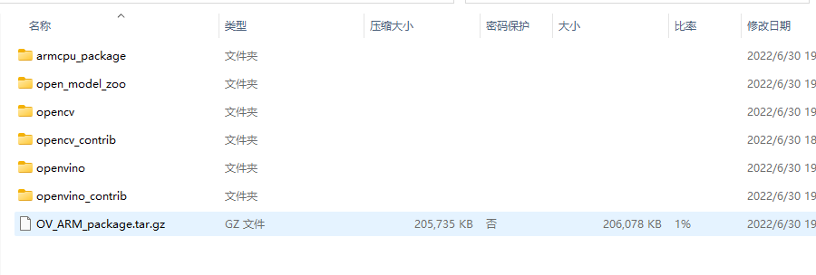
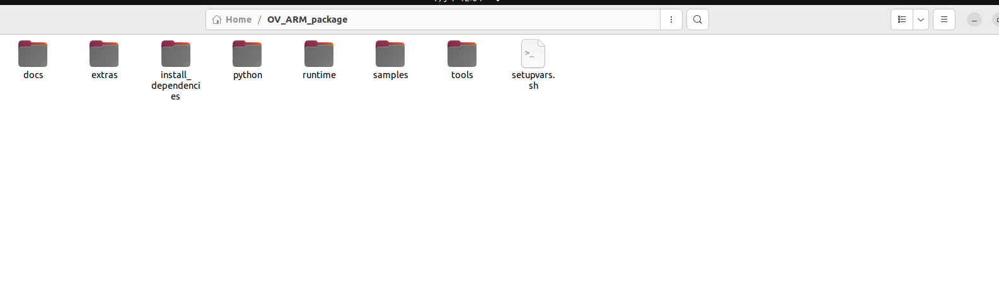

# 附带opencv和扩展包的arm_openvino交叉编译并实现基于nanodet的目标识别

## 导言

本文将使用**ubuntu22.04LTS+docker+cmake**实现对aarch64平台opencv和openvino库的交叉编译。使树莓派4B能够调用opencv库和openvino库，不仅能够基于c++代码实现目标识别，也能使用python编程。

## 设备

- x86电脑主机 (ubuntu 22.04LTS)
- Raspberry Pi 4b (ubuntu 22.04LTS)
  
## 编译构建

参考[openvino_contrib](https://github.com/openvinotoolkit/openvino_contrib/wiki/How-to-build-ARM-CPU-plugin)的第一种编译方式，进行了大幅度修改，使得能够同时安装opencv库和openvino库及其扩展包。

### 1. 编译构建

    git clone https://github.com/elben6exam/raspbeery_pi4_arm_openvino.git
    cd arm_plugin
    docker image build -t arm-plugin -f dockerfiles/Dockerfile.RPi64_focal . 

根据openvino_contrib库的docker文件支持表：
  - Dockerfile.RPi32_buster - 32-bit Docker 10 (Buster)
  - Dockerfile.RPi32_stretch - 32-bit Docker 9 (Stretch)
  - Dockerfile.RPi64_bionic - 64-bit Ubuntu 18.04 (Bionic)
  - Dockerfile.RPi64_focal - 64-bit Ubuntu 20.04 (Focal)

Dockerfile.RPi64支持在树莓派上的ubuntu20.04系统，但是经过测试，编译生成的文件同样能在22.04版本运行

### 2.编译

    mkdir build
    docker container run --rm -ti -v $PWD/build:/arm_cpu_plugin arm-plugin

为期不少于40分钟的交叉编译将会在build文件上进行。请注意，此过程包含git克隆，cmake编译和安装操作;因为克隆文件数目众多,而且所有git库的子模块都需要被克隆，所以难免会出现克隆失败的情况，致使编译产生的文件不全。请适当修改.\arm_plugin\scripts\arm_cpu_plugin_build.sh文件内的git克隆地址或者检查主机的网络环境。

### 3.完成

编译结束后在build文件内会产生如下文件

我们仅需取**OV_ARM_packgage.tar.gz**压缩文件文件解压到树莓派上。

此时可以准备目标识别代码，一齐拷贝到开发板上。

笔者使用nanodet进行目标检测。

    git clone https://github.com/RangiLyu/nanodet.git

将此文件一同移送到树莓派上。

## 配置环境

在树莓派中解压OV_ARM_packgage.tar.gz，取得如下文件。

### 安装依赖项

#### python

强烈建议安装python3.7，因为关于python部分的调用函数是基于3.7版本编写的。

若python版本在3.6-3.9之外，配置会默认不成功。

经过测试，python3.10也可以运行，只需打开setupvars.sh文件，将**Max_Supported_Python_Version_Minor**的数值从9改为10

#### 其它

若树莓派的系统为ubuntu18.04或者是20.04,可运行文件夹install_dependencies中的**install_openvino_dependences.sh**文件自动安装。

若版本为22.04,则手动安装模块如下(sudo apt-get install)：
    libgtk-3-0 libgli1 
     
    python-is-python3 python3-dev python3-venv python3-setuptools python3-pip 
     
    cmake pkg-config g++ gcc libc6-dev libgflags-dev zlib1g-dev nlohamn-json3-dev make curl sudo 
     
    libusb-1.0-0 

    libtinfo5

    gstreamer1.0-plugins-bad gstreamer1.0-plugins-base  gstreamer1.0-plugins-good gstreamer1.0-plugins-ugly
    gstreamer1.0-tools
    libavcodec58
    libavformat58
    libavresample4
    libavutil56
    libgstreamer1.0-0
    libswscale5
    
### 配置

将setupvars.sh文件添加到系统路径中，即可添加opencv和openvino库。

    sudo gedit ~/.bashrc
    (在文本中添加) source <INSTALL_DIR>/setupvars.sh

再次打开终端，若提示openvino已初始化，则配置成功。

## 实例验证

使用nanodet验证。参照教程 [NanoDet OpenVINO Demo](https://github.com/RangiLyu/nanodet/tree/main/demo_openvino)
    git clone https://github.com/RangiLyu/nanodet.git
    cd nanodet/demo_openvino
    mkdir build && cd build
    cmake ..
    make 

编译生成nanodet_demo文件，在build文件下放置模型，可以在[此处](https://drive.google.com/file/d/1dAwIA2pMkSetPEcvB0dvmLaOAK-9h-Lm/view?usp=sharing)(记得翻墙)下载

将文件重命名为nanodet.xml, nanodet.mapping, nanodet.bin。
按照以下方式运行文件

    ./nanodet_demo 1 ${IMAGE_FOLDER}/*.jpg

即可得到目标识别的结果

## YOLOV5模型部署

仍然在研究中，参考以下资料：

- [yolov5-opencv-cpp-python](https://github.com/doleron/yolov5-opencv-cpp-python),opencv部署方式

- [yolov5_cpp_openvino](https://github.com/fb029ed/yolov5_cpp_openvino) 参考yolov5模型转换的方法

- [Object Detection C++ Demo](https://docs.openvino.ai/latest/omz_demos_object_detection_demo_cpp.html)